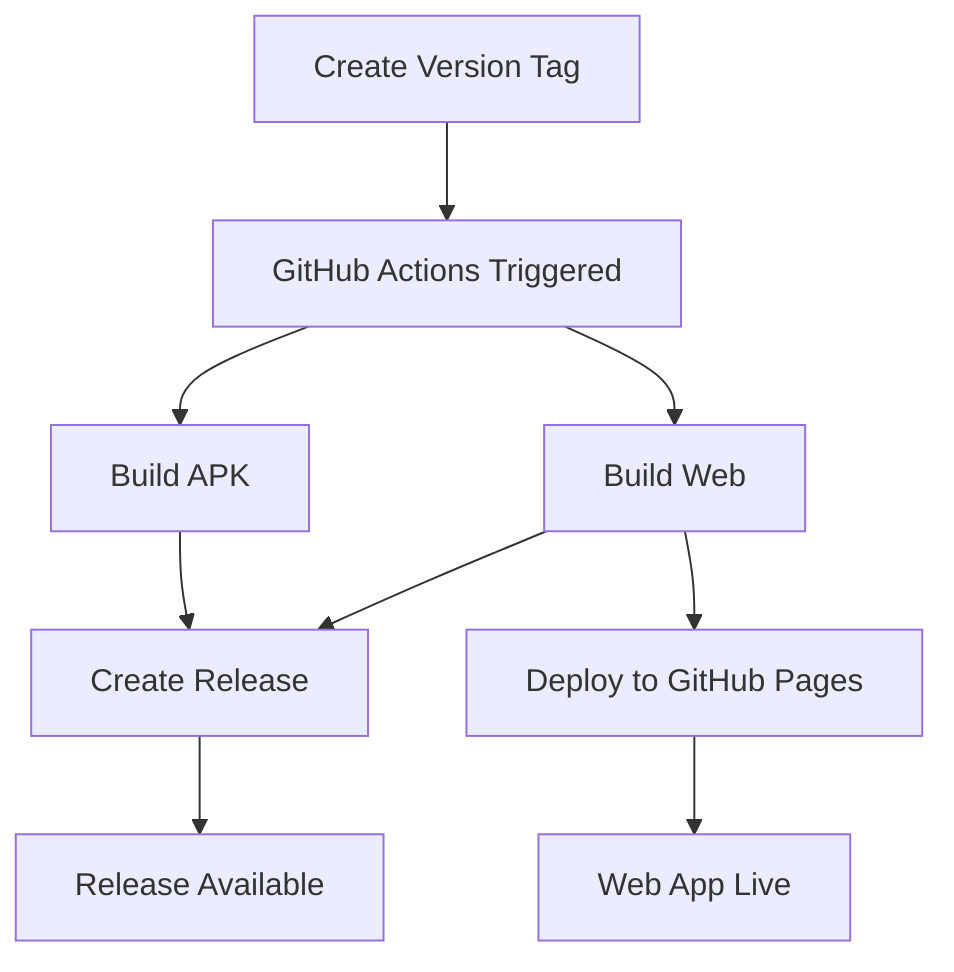

# DCG Application Release Guide

This guide explains how to build and release both APK and web versions of the DCG Application using GitHub Actions.

## 🚀 Quick Release

### Option 1: Automatic Release (Recommended)
```bash
# Run the release script
./release.sh
```

This script will:
1. Update the version in `pubspec.yaml`
2. Create a git tag
3. Push to GitHub
4. Trigger automatic build and release

### Option 2: Manual Tag Creation
```bash
# Update version in pubspec.yaml first, then:
git add pubspec.yaml
git commit -m "Bump version to 1.0.0"
git tag v1.0.0
git push origin flutter
git push origin v1.0.0
```

## 📋 Release Workflows

### 1. Build and Release (`build-and-release.yml`)
- **Trigger**: Version tags (v*.*.*) or manual dispatch
- **Builds**: APK + Web
- **Output**: GitHub Release with both builds
- **Deploys**: Web to GitHub Pages

### 2. Manual Build (`manual-build.yml`)
- **Trigger**: Manual dispatch only
- **Builds**: APK, Web, or both (selectable)
- **Output**: Build artifacts only (for testing)

### 3. Web Deploy (`deploy.yml`)
- **Trigger**: Push to flutter branch
- **Builds**: Web only
- **Output**: Deploys to GitHub Pages

## 📱 Build Outputs

### APK (Android)
- **Location**: `build/app/outputs/flutter-apk/app-release.apk`
- **Target**: Android devices
- **Size**: ~20-50MB (typical Flutter app)

### Web Build
- **Location**: `build/web/`
- **Target**: Web browsers
- **Deployment**: GitHub Pages + downloadable archive

## 🛠️ Setup Requirements

### Repository Settings
1. Go to **Settings** → **Pages**
2. Set source to **GitHub Actions**
3. Enable **Actions** in **Settings** → **Actions**

### Permissions
The workflows require these permissions:
- `contents: write` - For creating releases
- `pages: write` - For GitHub Pages deployment
- `id-token: write` - For GitHub Pages authentication

## 📊 Release Process Flow



## 🔄 Version Management

### Semantic Versioning
Use semantic versioning (MAJOR.MINOR.PATCH):
- **MAJOR**: Breaking changes
- **MINOR**: New features (backward compatible)
- **PATCH**: Bug fixes

### Examples
- `v1.0.0` - Initial release
- `v1.1.0` - New features added
- `v1.1.1` - Bug fixes

## 📥 Download Links

After a successful release:

- **APK**: `https://github.com/sumon-infinity/DCG-Application/releases`
- **Web**: `https://sumon-infinity.github.io/DCG-Application/`
- **Source**: `https://github.com/sumon-infinity/DCG-Application`

## 🐛 Troubleshooting

### Build Fails
1. Check the Actions tab for error logs
2. Ensure `pubspec.yaml` is valid
3. Verify Flutter version compatibility

### APK Issues
- Check Android SDK requirements in `android/app/build.gradle`
- Ensure Java 17 is used (configured in workflow)

### Web Issues
- Check for web-specific dependencies
- Verify build output in `build/web/`

### Permission Errors
- Ensure repository has Actions enabled
- Check that GITHUB_TOKEN has necessary permissions

## 🔧 Customization

### Modify Build Settings
Edit `.github/workflows/build-and-release.yml`:

```yaml
# Change Flutter version
flutter-version: '3.24.0'

# Modify build commands
run: flutter build apk --release --target-platform android-arm64
```

### Custom Release Notes
Edit the release body in `build-and-release.yml`:

```yaml
body: |
  ## Your Custom Release Notes
  - Feature 1
  - Bug fix 2
```

## 📞 Support

For issues with the release process:
1. Check the [Actions tab](https://github.com/sumon-infinity/DCG-Application/actions)
2. Review workflow logs
3. Create an issue in the repository
